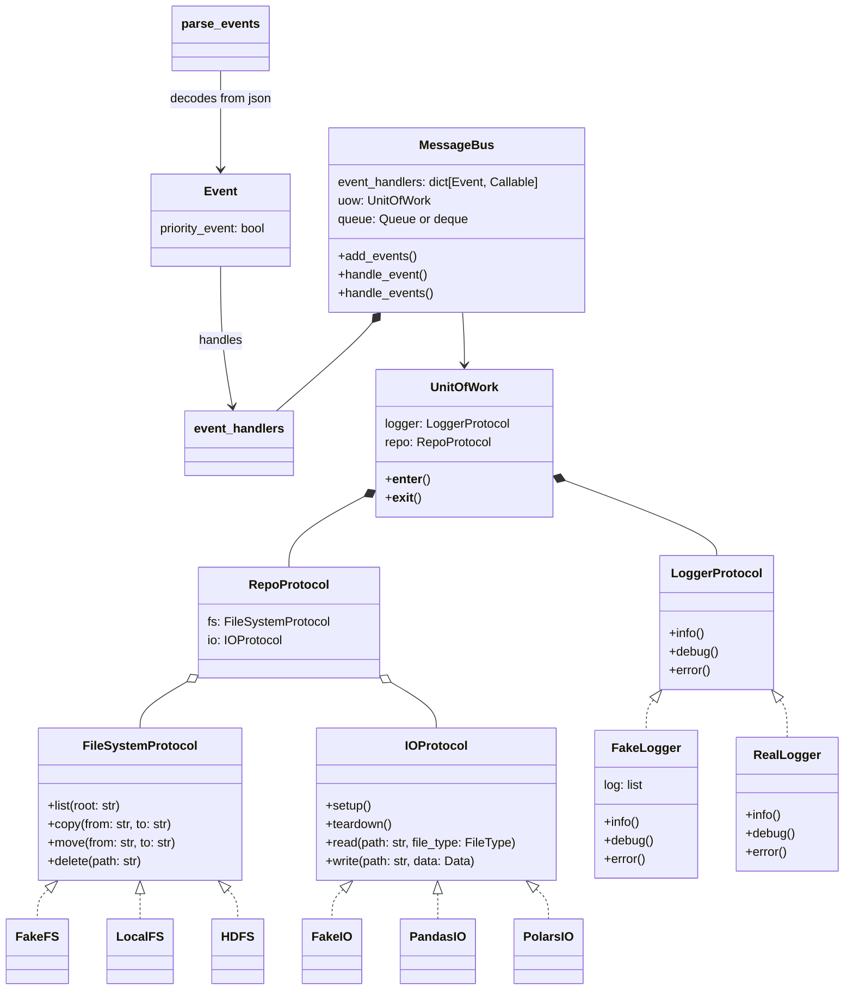

# Place to mess about with the ideas from the cosmic python book

```mermaid
classDiagram

%% === Adapters.fs_wrappers ===
class FileSystemProtocol {
    +list(root: str)
    +copy(from: str, to: str)
    +move(from: str, to: str)
    +delete(path: str)
}

class FakeFS
class LocalFS
class HDFS

FileSystemProtocol <|.. FakeFS
FileSystemProtocol <|.. LocalFS
FileSystemProtocol <|.. HDFS

%% === Adapters.io_wrappers ===
class IOProtocol {
    +setup()
    +teardown()
    +read(path: str, file_type: FileType)
    +write(path: str, data: Data)
}

class FakeIO
class PandasIO
class PolarsIO

IOProtocol <|.. FakeIO
IOProtocol <|.. PandasIO
IOProtocol <|.. PolarsIO

%% === Adapters.logger ===
class LoggerProtocol {
    +info()
    +debug()
    +error()
}

class FakeLogger {
    log: list
    +info()
    +debug()
    +error()
}

class RealLogger {
    +info()
    +debug()
    +error()
}

LoggerProtocol <|.. FakeLogger
LoggerProtocol <|.. RealLogger

%% === Adapters.repo ===
class RepoProtocol {
    fs: FileSystemProtocol
    io: IOProtocol
}

RepoProtocol o-- FileSystemProtocol
RepoProtocol o-- IOProtocol

%% === Usecases ===
class Event {
    priority_event: bool
}

class parse_events
class event_handlers

parse_events --> Event : decodes from json
Event --> event_handlers : handles

%% === Service Layer ===
class UnitOfWork {
    logger: LoggerProtocol
    repo: RepoProtocol
    +__enter__()
    +__exit__()
}

UnitOfWork *-- LoggerProtocol
UnitOfWork *-- RepoProtocol

class MessageBus {
    event_handlers: dict[Event, Callable]
    uow: UnitOfWork
    queue: Queue or deque
    +add_events()
    +handle_event()
    +handle_events()
}

MessageBus --> UnitOfWork
MessageBus *-- event_handlers

```