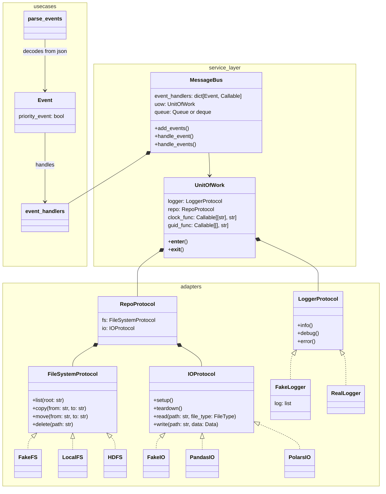

# Place to mess about with the ideas from the cosmic python book



# Repo map
```
├── .github
│   └── workflows
│       └── ci_tests.yaml
├── src
│   └── cosmic_python_sandbox
│       ├── adapters
│       │   ├── fs_wrappers
│       │   │   ├── __init__.py
│       │   │   ├── _fs_protocol.py
│       │   │   └── local_fs_wrapper.py
│       │   ├── io_wrappers
│       │   │   ├── __init__.py
│       │   │   ├── _io_protocol.py
│       │   │   ├── pd_io.py
│       │   │   └── pl_io.py
│       │   ├── __init__.py
│       │   ├── clock.py
│       │   ├── logger.py
│       │   └── repo.py
│       ├── domain
│       │   └── __init__.py
│       ├── service_layer
│       │   ├── __init__.py
│       │   ├── message_bus.py
│       │   └── uow.py
│       ├── usecases
│       │   ├── __init__.py
│       │   ├── _event.py
│       │   ├── copy_file.py
│       │   ├── delete_file.py
│       │   └── move_file.py
│       ├── utils
│       │   ├── __init__.py
│       │   ├── detect_io_infection.py
│       │   └── fake_io_generation.py
│       ├── __init__.py
│       └── __main__.py
├── tests
│   ├── adapters
│   │   ├── __init__.py
│   │   └── test_fake_logger.py
│   ├── service_layer
│   │   ├── __init__.py
│   │   └── test_message_bus.py
│   ├── usecases
│   │   ├── __init__.py
│   │   ├── test_events.py
│   │   └── test_handlers.py
│   ├── utils
│   │   ├── __init__.py
│   │   ├── test_detect_io_infection.py
│   │   └── test_fake_io_generation.py
│   ├── __init__.py
│   └── test_fakes_api.py
├── README.md
├── pyproject.toml
├── ruff.toml
└── uv.lock
::
```